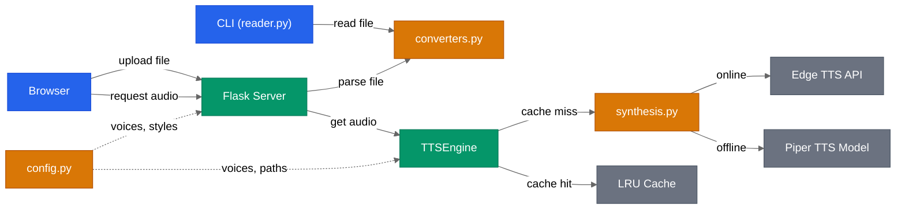

# TTS Reader

<div align="center">

[](https://github.com/AndreaBonn/text-to-speech/actions/workflows/ci.yml)
[](https://github.com/AndreaBonn/text-to-speech/actions/workflows/ci.yml)
[](https://github.com/AndreaBonn/text-to-speech/actions/workflows/ci.yml)
[](https://github.com/astral-sh/ruff)
[](LICENSE)
[](SECURITY.md)

</div>

> **[Leggi in italiano](README.it.md)**

A tool for reading text files aloud in Italian, with both a web interface and
a command-line interface. Supports Markdown, TXT, EPUB, DOCX, HTML, and PDF
with 5 Italian neural voices. The default voice (Giuseppe) is multilingual
and correctly pronounces English terms within Italian text.


## Features

- Read text files aloud (Markdown, TXT, EPUB, DOCX, HTML, PDF), paragraph by paragraph
- 8 voices: 7 online (Edge TTS) + 1 offline (Piper TTS)
- Italian and English voices with multilingual support
- 4 reading styles: Neutral, Newscast, Audiobook, Slow (Edge TTS only)
- Web interface with audio player (play, pause, stop, previous, next, repeat)
- Bilingual UI: Italian and English with language switcher
- CLI for terminal usage
- Save audio as MP3 (single file + individual paragraphs)
- Smart prefetch: synthesizes the next paragraph during playback
- Automatic Markdown-to-plain-text conversion (via pandoc or regex fallback)

## System Requirements

- Python 3.10+
- ffmpeg (audio conversion and playback)
- pandoc (optional, improves Markdown conversion)

The CLI automatically detects the operating system and uses the appropriate
audio player: `aplay` on Linux, `afplay` on macOS, `ffplay` on Windows.
If the native player is unavailable, `ffplay` (included with ffmpeg) is used
as a fallback on all systems.

## Installation

### System Dependencies

**Linux (Debian/Ubuntu)**
```bash
sudo apt install ffmpeg alsa-utils pandoc
```

**Linux (Fedora)**
```bash
sudo dnf install ffmpeg alsa-utils pandoc
```

**Linux (Arch)**
```bash
sudo pacman -S ffmpeg alsa-utils pandoc
```

**macOS**
```bash
brew install ffmpeg pandoc
```
`afplay` is already included in macOS.

**Windows**
```powershell
# With Chocolatey
choco install ffmpeg pandoc

# Or with Scoop
scoop install ffmpeg pandoc
```

### Automated Setup (Recommended)

```bash
git clone https://github.com/AndreaBonn/text-to-speech.git
cd text-to-speech

# Linux/macOS
bash scripts/setup.sh

# Windows (PowerShell)
powershell -ExecutionPolicy Bypass -File scripts\setup.ps1
```

The script checks for Python 3.10+, verifies system dependencies,
creates a virtual environment, and installs Python packages.

### Manual Setup

```bash
git clone https://github.com/AndreaBonn/text-to-speech.git
cd text-to-speech
python -m venv venv
source venv/bin/activate        # Linux/macOS
# venv\Scripts\activate         # Windows (cmd)
# venv\Scripts\Activate.ps1     # Windows (PowerShell)
pip install -r requirements.txt
```

## Usage

### Web Interface

```bash
source venv/bin/activate
python app.py
```

Open **http://localhost:5000** in your browser. The interface allows you to:


- Upload a file from disk (MD, TXT, EPUB, DOCX, HTML, PDF)
- Choose a voice from the dropdown menu
- Select a reading style (Neutral, Newscast, Audiobook, Slow)
- Switch between Italian and English UI using the language buttons (IT/EN)
- Use player controls: play/pause, stop, previous, next, repeat
- Click the progress bar to jump to any paragraph
- Download the complete audio as MP3

Keyboard shortcuts: `Space` play/pause, `Left/Right arrow` prev/next, `R` repeat.

The reading style is automatically suggested based on file format:
- EPUB files → Audiobook style (relaxed pace)
- Markdown/HTML → Newscast style (faster pace)
- Other formats → Neutral style

### Command Line

```bash
source venv/bin/activate

# Read with default voice (Giuseppe, multilingual)
python reader.py file.md

# Choose a voice
python reader.py file.md --voice isabella

# English voices
python reader.py document.md --voice andrew
python reader.py document.md --voice ava

# Offline voice (no internet required)
python reader.py file.md --voice paola

# Save as MP3
python reader.py file.md --voice giuseppe --salva
```

**Note:** Reading styles are only available in the web interface. The CLI uses
the default neutral style for all voices.

With `--salva`, the following structure is created:
```
data/output/<filename>/
├── full/<filename>.mp3       # Complete audio
└── paragraphs/
    ├── 001.mp3                # Individual paragraphs
    ├── 002.mp3
    └── ...
```

## Available Voices


| Voice | Engine | Gender | Language | Multilingual | Requires Internet |
|-------|--------|--------|----------|--------------|-------------------|
| giuseppe | Edge TTS | Male | Italian | Yes (IT/EN) | Yes |
| isabella | Edge TTS | Female | Italian | No | Yes |
| elsa | Edge TTS | Female | Italian | No | Yes |
| diego | Edge TTS | Male | Italian | No | Yes |
| andrew | Edge TTS | Male | English | Yes (EN/IT) | Yes |
| ava | Edge TTS | Female | English | Yes (EN/IT) | Yes |
| ryan | Edge TTS | Male | English | No | Yes |
| paola | Piper TTS | Female | Italian | No | No (offline) |

**Giuseppe** is recommended for technical texts with English terms.
**Paola** works without an internet connection (the model is automatically
downloaded on first use, approximately 60 MB).

## Reading Styles

The web interface offers 4 reading styles (Edge TTS voices only):

| Style | Speed | Pitch | Best For |
|-------|-------|-------|----------|
| Neutral | Normal | Normal | General reading |
| Newscast | +13% | +5Hz | News, articles, fast-paced content |
| Audiobook | -8% | -3Hz | Books, relaxed listening |
| Slow | -20% | Normal | Study, comprehension, language learning |

The style is automatically suggested based on file format (e.g., EPUB → Audiobook, MD → Newscast).

## Security

This project implements multiple security layers. See [SECURITY.md](SECURITY.md)
for a detailed overview of all mechanisms in place.

## Architecture



For detailed technical diagrams (playback sequence, conversion pipeline), see [docs/ARCHITECTURE.md](docs/ARCHITECTURE.md).

## Project Structure

```
text-to-speech/
├── app.py              # Flask web server
├── tts_engine.py       # TTS engine with cache and prefetch
├── synthesis.py        # Speech synthesis functions (Piper, Edge)
├── config.py           # Voice configuration, model paths, constants
├── translations.py     # Backend translations (API messages, styles)
├── reader.py            # CLI: terminal reading
├── converters.py       # Format converters → plain text
├── static/
│   ├── style.css       # Design system (Ink & Amber)
│   ├── player.js       # JavaScript audio player
│   └── i18n.js         # Frontend i18n system (IT/EN)
├── templates/
│   └── index.html      # Web interface (HTML only)
├── tests/
│   ├── conftest.py     # Shared fixtures (client, engine)
│   └── test_*.py       # Test suite (pytest)
├── scripts/
│   ├── setup.sh       # Automated setup Linux/macOS
│   └── setup.ps1      # Automated setup Windows
├── data/
│   ├── input/          # Source files to read
│   └── output/         # Audio generated with --salva
├── requirements.txt    # Python dependencies
└── README.md
```

## License

This project is released under the **GPL-3.0** license. See the
[LICENSE](LICENSE) file for details.

## Disclaimers

Edge TTS voices (giuseppe, isabella, elsa, diego, andrew, ava, ryan) use an
unofficial Microsoft Edge "Read Aloud" API. This service is not guaranteed and
may stop working at any time. It is not authorized for commercial use.
For commercial applications, consider
[Azure AI Speech](https://azure.microsoft.com/en-us/products/ai-services/text-to-speech).

**Single-user**: the web application uses a single shared TTS engine instance
across all requests. It is not designed for simultaneous multi-user access.
If multiple users upload files concurrently, data will be overwritten.

The Paola voice (Piper TTS) is fully offline and free from restrictions
(training dataset under CC0 public domain license).

## Support the project

TTS Reader is free to use. If it helps you and you want to give something back,
you can leave a tip via PayPal. The amount is up to you and it is entirely optional.

<div align="center">

[](https://paypal.me/AndreaBonacci19)

</div>
